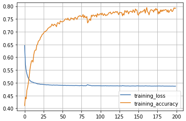
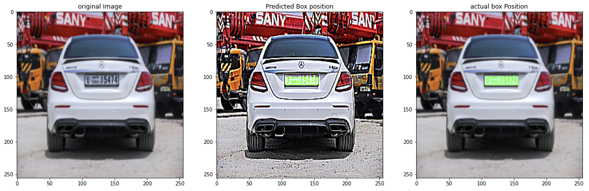

### Description
Realization of U-net to find the car number plates on the photo.

###Technologies
1. [OpenCV](https://pypi.org/project/opencv-python/)
2. [Keras](https://pypi.org/project/keras/)
3. [TensorFlow](https://pypi.org/project/tensorflow/)
4. [bs4](https://pypi.org/project/beautifulsoup4/)

### Dataset
1. 433 photos of cars
2. 433 xml files with coordinates of car number plate

You can find it [here](https://drive.google.com/drive/folders/139dUNn8Uxo3SdEEwMEtevncmE7OHxerh?usp=sharing)

### Colab
You can work in colab. All dependencies already installed there. Also [link](https://colab.research.google.com/drive/1d-VFBYgRHPumDNkgoQQhIlOxTPbI5cqg?usp=sharing) to my notebook.

### Learning curve

### Example of work

